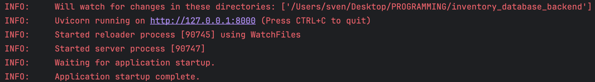

# Inventory Database Part : Backend


## Introduction

This project is a collaboration between Centria and Hochschule Darmstadt to develop 
a Locker/Renting/Charging System for universities. 
This repository contains the Backend part, it is based on:
- FastAPI
- SQLAlechemy / alembic

The other repository can be found here :
-  Frontend: https://github.com/kekkeller/inventory_database_frontend/
-  Arduino: https://github.com/slepp22/inventory_database_arduino

## Setting up your local dev-environment
The following steps are based on the assumption you're using PyCharm, some part can differ for other IDEs
### Pre-requisites
- Postgres Database
- Python 
- pip (included in Python since 3.4)
### Set-Up
#### Database
Make sure your local Postgres Database is running, I used this configuration, but you can also use your own as we will 
custom environment variables later on anyway:
```
DATABASE_USERNAME = os.getenv('DATABASE_USERNAME', 'admin')
DATABASE_PASSWORD = os.getenv('DATABASE_PASSWORD', 'admin')
DATABASE_HOST = os.getenv('DATABASE_HOST', 'localhost')
DATABASE_PORT = os.getenv('DATABASE_PORT', '5432')
DATABASE_NAME = os.getenv('DATABASE_NAME', 'postgres')
```
#### Setup in PyCharm
First thing we need to do, is to Clone the Repository. 
If you used other credentials for the database, you can change them in the .env file.
After setting up the environment variables, the next step will be to generate and activate the virtual environment.
There run following command in the terminal:
1) This will generate a virtual environment with the name venv
```bash
python -m venv venv
```
2) Activate the virtual environment
```bash
Windows:
venv\Scripts\activate

MacOS:
source venv/bin/activate 
```
3) Install dependencies
```bash
pip install -r requirements.txt 
```

**Now the development environment is setup and you can start the application by clicking on "Run"**
You should see this message if the setup was successfull:



##### Database Migrations
To create the database schema, you can run the following command:
```bash
alembic revision --autogenerate -m "Initial migration"
```
This will create a new migration file in the alembic/versions folder. To apply the migration, run the following command:
```bash
alembic upgrade head
```
This will create the necessary tables in the database.

## Deployment
### Database
The Postgres Database is setup on Google Cloud SQL (Postgres 15)
Please be aware that you cant just connect with to the database Public IP with the credentials. Your own network must 
be added in the Google Cloud Web Interface, so it only allows connection from known networks.

### FastAPI Container
The backend is hosted on Google Cloud Run. To deploy a new version following pre-requisites are needed:
- Google Cloud Run CLI
- Google Cloud Run User with Project Permissions and Authenticated in CLI
- Docker


To deploy a new version a docker please follow these steps:
1) Create new Docker image
```bash
docker buildx build -t sleppp/inventory-backend --platform linux/amd64 .
```
2) Tag image for Google Cloud Run
```bash
docker tag sleppp/inventory-backend gcr.io/inventory-database-420916/inventory-backend
```

3) Push image for Google Cloud Run
```bash
docker push gcr.io/inventory-database-420916/inventory-backend:latest
```
## SQL Scripts for Test Data
```sql
INSERT INTO users (firstname, lastname, email, password, role)
VALUES ('Firstname1', 'Lastname1', 'user1@example.com', 'password1', 'student');

INSERT INTO users (firstname, lastname, email, password, role)
VALUES ('Firstname2', 'Lastname2', 'user2@example.com', 'password2', 'admin');

```
If you encounter any errors during the deployment process, make sure you are authenticated with Google Cloud CLI 
(gcloud auth login) and have the necessary permissions to push images to Google Container Registry. For troubleshooting 
tips or common errors, refer to the Google Cloud Run documentation.


<!-- Insert a blank line here -->


